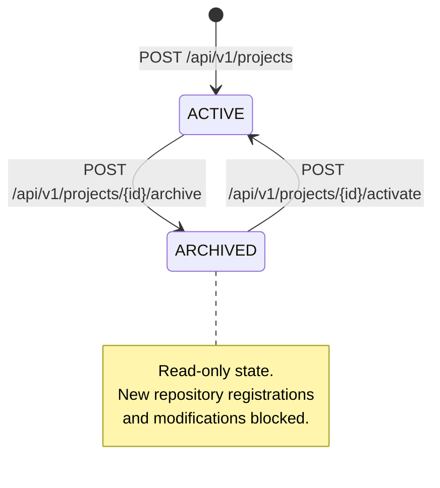
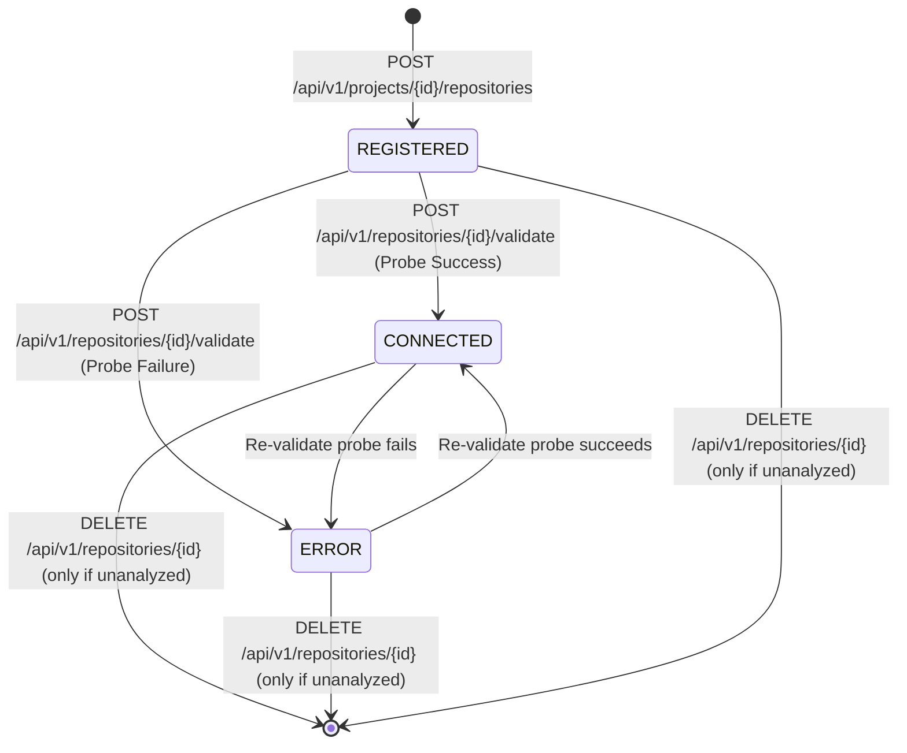

# Data Model: TRACE Phase 1 — Project & Repository Management

**Branch**: `002-project-repository-management` | **Date**: 2026-09-28 | **Feature**: F01 Project & Repository Management

This document defines the formal data models for TRACE Phase 1 (F01). In accordance with TRACE Constitution §VIII (Explicit Contracts) and §XIV (Clean Architecture), contracts are strictly separated into:
1. **Domain Entities & Value Objects** (`trace/domain/`) — Pure Python dataclasses and StrEnums with zero framework or I/O imports.
2. **Relational Persistence Models** (`trace/infrastructure/database/models/`) — SQLAlchemy 2.0 declarative mappings for PostgreSQL.
3. **API Request & Response Contracts** (`trace/api/`) — Pydantic v2 schemas for HTTP serialization and validation.

---

## 1. Domain Entities & Value Objects (`trace/domain/`)

### `ProjectStatus`
```python
from enum import StrEnum

class ProjectStatus(StrEnum):
    ACTIVE = "ACTIVE"
    ARCHIVED = "ARCHIVED"
```

### `Project`
```python
from dataclasses import dataclass
from datetime import datetime
import uuid
from trace.domain.project import ProjectStatus

@dataclass(frozen=True)
class Project:
    id: uuid.UUID
    name: str
    description: str | None
    status: ProjectStatus
    created_at: datetime
    updated_at: datetime
```

### `RepositoryType`
```python
from enum import StrEnum

class RepositoryType(StrEnum):
    LOCAL = "LOCAL"
    REMOTE = "REMOTE"
```

### `RepositoryStatus`
```python
from enum import StrEnum

class RepositoryStatus(StrEnum):
    REGISTERED = "REGISTERED"
    CONNECTED = "CONNECTED"
    ERROR = "ERROR"
```

### `Repository`
```python
from dataclasses import dataclass
from datetime import datetime
import uuid
from trace.domain.repository import RepositoryStatus, RepositoryType

@dataclass(frozen=True)
class Repository:
    id: uuid.UUID
    project_id: uuid.UUID
    type: RepositoryType
    location: str
    default_branch: str | None
    status: RepositoryStatus
    last_error: str | None
    last_validated_at: datetime | None
    last_analysis_run_id: uuid.UUID | None
    created_at: datetime
    updated_at: datetime
```

### `ConnectionValidationResult`
```python
from dataclasses import dataclass

@dataclass(frozen=True)
class ConnectionValidationResult:
    is_connected: bool
    detected_branch: str | None
    error_message: str | None
    latency_ms: float
```

---

## 2. Relational Persistence Models (`trace/infrastructure/database/models/`)

### SQLAlchemy Base Class
```python
from sqlalchemy.orm import DeclarativeBase

class Base(DeclarativeBase):
    pass
```

### `ProjectOrm` (`projects` Table)
```python
from datetime import datetime, timezone
import uuid
from sqlalchemy import String, Text, DateTime
from sqlalchemy.orm import Mapped, mapped_column, relationship
from trace.infrastructure.database.models.base import Base

class ProjectOrm(Base):
    __tablename__ = "projects"

    id: Mapped[uuid.UUID] = mapped_column(primary_key=True, default=uuid.uuid4)
    name: Mapped[str] = mapped_column(String(100), unique=True, index=True, nullable=False)
    description: Mapped[str | None] = mapped_column(Text, nullable=True)
    status: Mapped[str] = mapped_column(String(20), default="ACTIVE", nullable=False)
    created_at: Mapped[datetime] = mapped_column(
        DateTime(timezone=True), default=lambda: datetime.now(timezone.utc), nullable=False
    )
    updated_at: Mapped[datetime] = mapped_column(
        DateTime(timezone=True),
        default=lambda: datetime.now(timezone.utc),
        onupdate=lambda: datetime.now(timezone.utc),
        nullable=False,
    )

    repositories: Mapped[list["RepositoryOrm"]] = relationship(
        "RepositoryOrm", back_populates="project"
    )
```

### `RepositoryOrm` (`repositories` Table)
```python
from datetime import datetime, timezone
import uuid
from sqlalchemy import ForeignKey, String, Text, DateTime, UniqueConstraint
from sqlalchemy.orm import Mapped, mapped_column, relationship
from trace.infrastructure.database.models.base import Base

class RepositoryOrm(Base):
    __tablename__ = "repositories"

    id: Mapped[uuid.UUID] = mapped_column(primary_key=True, default=uuid.uuid4)
    project_id: Mapped[uuid.UUID] = mapped_column(
        ForeignKey("projects.id"), nullable=False, index=True
    )
    type: Mapped[str] = mapped_column(String(20), nullable=False)
    location: Mapped[str] = mapped_column(String(500), nullable=False)
    default_branch: Mapped[str | None] = mapped_column(String(100), nullable=True)
    status: Mapped[str] = mapped_column(String(20), default="REGISTERED", nullable=False)
    last_error: Mapped[str | None] = mapped_column(Text, nullable=True)
    last_validated_at: Mapped[datetime | None] = mapped_column(DateTime(timezone=True), nullable=True)
    last_analysis_run_id: Mapped[uuid.UUID | None] = mapped_column(nullable=True)
    created_at: Mapped[datetime] = mapped_column(
        DateTime(timezone=True), default=lambda: datetime.now(timezone.utc), nullable=False
    )
    updated_at: Mapped[datetime] = mapped_column(
        DateTime(timezone=True),
        default=lambda: datetime.now(timezone.utc),
        onupdate=lambda: datetime.now(timezone.utc),
        nullable=False,
    )

    project: Mapped["ProjectOrm"] = relationship("ProjectOrm", back_populates="repositories")

    __table_args__ = (
        UniqueConstraint("project_id", "location", name="uq_project_location"),
    )
```

---

## 3. State Lifecycle & Transitions

### Project Lifecycle


### Repository Status Lifecycle


---

## 4. Entity Relationships & Invariants

```text
┌────────────────────────────────────────────────────────┐
│                        Project                         │
├────────────────────────────────────────────────────────┤
│ id: UUID [PK]                                          │
│ name: VARCHAR(100) [UNIQUE, INDEXED]                   │
│ description: TEXT [NULLABLE]                           │
│ status: VARCHAR(20) [ACTIVE | ARCHIVED]                │
│ created_at: TIMESTAMPTZ                                │
│ updated_at: TIMESTAMPTZ                                │
└──────────────────────────┬─────────────────────────────┘
                           │ 1
                           │
                           │ has many (archival model, no cascade delete)
                           │
                           ▼ *
┌────────────────────────────────────────────────────────┐
│                       Repository                       │
├────────────────────────────────────────────────────────┤
│ id: UUID [PK]                                          │
│ project_id: UUID [FK -> projects.id, INDEXED]          │
│ type: VARCHAR(20) [LOCAL | REMOTE]                     │
│ location: VARCHAR(500)                                 │
│ default_branch: VARCHAR(100) [NULLABLE]                │
│ status: VARCHAR(20) [REGISTERED | CONNECTED | ERROR]   │
│ last_error: TEXT [NULLABLE]                            │
│ last_validated_at: TIMESTAMPTZ [NULLABLE]              │
│ last_analysis_run_id: UUID [NULLABLE, Denormalized]    │
│ created_at: TIMESTAMPTZ                                │
│ updated_at: TIMESTAMPTZ                                │
├────────────────────────────────────────────────────────┤
│ CONSTRAINT uq_project_location (project_id, location)  │
└────────────────────────────────────────────────────────┘
```

### Business Invariants
1. **Name Uniqueness**: Project names must be unique across all projects (active and archived) to preserve historical audit integrity.
2. **Project-Scoped Repository Uniqueness**: The combination of `(project_id, normalized_location)` must be unique. Attempting to register an existing location under the same project raises `DuplicateRepositoryError` (HTTP 409).
3. **Archival Protection**: Repositories cannot be added, updated, or validated within an `ARCHIVED` project.
4. **Deletion Guard**: A repository can only be deleted via `DELETE /api/v1/repositories/{id}` if `last_analysis_run_id` is null. If an analysis run has been executed against the repository, deletion is rejected with `RepositoryInUseError` (HTTP 409) to preserve historical analysis auditability.
5. **Secret Prohibition**: Locations must never contain embedded credentials (`user:token@`). URLs with embedded credentials are rejected at the API boundary with HTTP 422.
6. **Zero Neo4j Nodes**: F01 models and mutations do not create or touch any Neo4j graph nodes.
