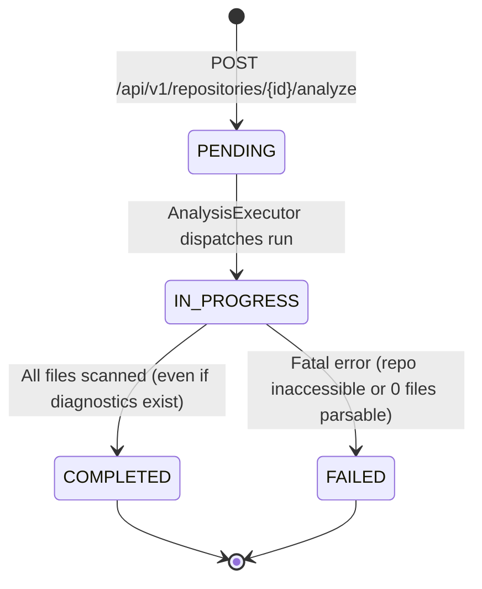

# Data Model Specification: TRACE Phase 2 — F02: Repository / Code Analyzer

**Feature Branch**: `003-repository-code-analyzer`  
**Date**: 2026-09-29  
**Spec Reference**: [spec.md](./spec.md)

---

## 1. Storage Architecture Overview

F02 implements a **dual-tier persistence architecture**:
1. **Relational Tier (PostgreSQL)**:
   - Stores `AnalysisRun` records in the `analysis_runs` table.
   - Tracks operational status (`PENDING`, `IN_PROGRESS`, `COMPLETED`, `FAILED`), timestamps, execution duration, summary metrics, error diagnostics count, and the filesystem artifact reference.
   - Updates `repositories.last_analysis_run_id` upon run completion to link repository history.
2. **Artifact Tier (Structured Filesystem)**:
   - Persists the complete `RepositoryAnalysis` domain aggregate as an immutable versioned JSON artifact at `storage/artifacts/analyses/{analysis_run_id}.json`.
   - Holds the exhaustive collection of thousands of fine-grained AST entities, parameters, decorator arguments, source locations, and structural relationships for consumption by Phase 3A (F03: Dependency Graph) and Phase 3B (F04: Version / Change Analyzer).

---

## 2. PostgreSQL Relational Model

```
┌────────────────────────────────────────────────────────┐
│                      AnalysisRun                       │
├────────────────────────────────────────────────────────┤
│ id: UUID [PK]                                          │
│ repository_id: UUID [FK -> repositories.id, Indexed]   │
│ project_id: UUID [FK -> projects.id, Indexed]          │
│ status: String(20) [Indexed]                           │
│ target_ref: String(100) [Nullable]                     │
│ resolved_revision: String(40) [Nullable] (exact SHA)   │
│ commit_hash: String(40) [Nullable]                     │
│ started_at: DateTime(UTC) [Nullable]                   │
│ completed_at: DateTime(UTC) [Nullable]                 │
│ duration_ms: Float [Nullable]                          │
│ total_files: Integer [Default: 0]                      │
│ python_files: Integer [Default: 0]                     │
│ total_modules: Integer [Default: 0]                    │
│ total_classes: Integer [Default: 0]                    │
│ total_functions: Integer [Default: 0]                  │
│ total_relationships: Integer [Default: 0]              │
│ total_diagnostics: Integer [Default: 0]                │
│ error_message: Text [Nullable]                         │
│ artifact_path: String(500) [Nullable]                  │
│ created_at: DateTime(UTC)                              │
│ updated_at: DateTime(UTC)                              │
├────────────────────────────────────────────────────────┤
│ Indexes:                                               │
│ - idx_analysis_runs_repo_created (repository_id,       │
│                                   created_at DESC)     │
│ - idx_analysis_runs_status (status)                    │
└────────────────────────────────────────────────────────┘
```

> [!NOTE]
> `analysis_runs.repository_id` is the authoritative relational foreign key linking each analysis run to its repository.
> `repositories.last_analysis_run_id` is an optional denormalized convenience reference used to accelerate status lookups in F01 and prevent accidental deletion of analyzed repositories.

### Table Definition (`analysis_runs`)

| Column | Type | Constraints | Description |
|---|---|---|---|
| `id` | `UUID` | Primary Key, Default `uuid4` | Unique analysis run identifier |
| `repository_id` | `UUID` | Foreign Key (`repositories.id`), NOT NULL, Index | Target repository being analyzed (Authoritative FK) |
| `project_id` | `UUID` | Foreign Key (`projects.id`), NOT NULL, Index | Parent project workspace |
| `status` | `VARCHAR(20)` | NOT NULL, Default `'PENDING'`, Index | State: `PENDING`, `IN_PROGRESS`, `COMPLETED`, `FAILED` |
| `target_ref` | `VARCHAR(100)` | Nullable | Target branch name or tag (e.g. `'main'`) |
| `resolved_revision` | `VARCHAR(40)` | Nullable | Exact 40-character Git commit SHA analyzed |
| `commit_hash` | `VARCHAR(40)` | Nullable | Git commit reference (legacy/alias) |
| `started_at` | `TIMESTAMPTZ` | Nullable | Timestamp when AST processing began |
| `completed_at` | `TIMESTAMPTZ` | Nullable | Timestamp when analysis concluded |
| `duration_ms` | `FLOAT` | Nullable | Elapsed execution time in milliseconds |
| `total_files` | `INTEGER` | NOT NULL, Default `0` | Count of all scanned files |
| `python_files` | `INTEGER` | NOT NULL, Default `0` | Count of discovered Python source files |
| `total_modules` | `INTEGER` | NOT NULL, Default `0` | Count of discovered modules & packages |
| `total_classes` | `INTEGER` | NOT NULL, Default `0` | Count of discovered classes |
| `total_functions` | `INTEGER` | NOT NULL, Default `0` | Count of discovered functions & methods |
| `total_relationships` | `INTEGER` | NOT NULL, Default `0` | Count of established relationships |
| `total_diagnostics` | `INTEGER` | NOT NULL, Default `0` | Count of errors/warnings encountered |
| `error_message` | `TEXT` | Nullable | Fatal failure diagnostic if status is `FAILED` |
| `artifact_path` | `VARCHAR(500)` | Nullable | Absolute or relative path to JSON artifact |
| `created_at` | `TIMESTAMPTZ` | NOT NULL | Record creation timestamp |
| `updated_at` | `TIMESTAMPTZ` | NOT NULL | Record update timestamp |

### State Transitions



---

## 3. Pure Domain Models (In-Memory & JSON Artifact)

All domain entities reside in `trace.domain.analysis` as pure frozen dataclasses with zero framework dependencies.

### 3.1 Base Value Objects

#### `SourceLocation`
```python
@dataclass(frozen=True)
class SourceLocation:
    file_path: str  # Relative POSIX path from repository root
    start_line: int  # 1-indexed
    end_line: int  # 1-indexed
    start_column: int | None = None
    end_column: int | None = None
```

#### `DecoratorDescriptor`
```python
@dataclass(frozen=True)
class DecoratorDescriptor:
    name: str  # Base decorator identifier, e.g. "app.get", "dataclass"
    raw_expression: str  # Complete source string, e.g. "@app.get('/items')"
    line_number: int
    arguments: tuple[str, ...] = ()
```

#### `ParameterDescriptor`
```python
@dataclass(frozen=True)
class ParameterDescriptor:
    name: str
    type_annotation: str | None = None
    has_default: bool = False
    default_value: str | None = None
```

---

### 3.2 Code Entities

#### `AnalyzedFile`
```python
class FileKind(StrEnum):
    PYTHON = "PYTHON"
    TEST = "TEST"
    CONFIG = "CONFIG"
    DOCUMENTATION = "DOCUMENTATION"
    DEPENDENCY = "DEPENDENCY"
    OTHER = "OTHER"

class FileStatus(StrEnum):
    PARSED = "PARSED"
    SKIPPED = "SKIPPED"
    ERROR = "ERROR"

@dataclass(frozen=True)
class AnalyzedFile:
    path: str
    file_type: FileKind
    size_bytes: int
    status: FileStatus
```

#### `Module`
```python
@dataclass(frozen=True)
class Module:
    qualified_name: str  # e.g., "trace.domain.repository"
    file_path: str
    is_package: bool  # True if __init__.py or namespace package
    docstring: str | None
    location: SourceLocation
```

#### `Class`
```python
@dataclass(frozen=True)
class Class:
    name: str
    qualified_name: str  # e.g., "trace.domain.repository.Repository"
    module_name: str
    parent_classes: tuple[str, ...]  # Base class expressions as written in AST
    decorators: tuple[DecoratorDescriptor, ...]
    docstring: str | None
    location: SourceLocation
```

#### `Function`
```python
class FunctionKind(StrEnum):
    FUNCTION = "FUNCTION"
    METHOD = "METHOD"
    CLASS_METHOD = "CLASS_METHOD"
    STATIC_METHOD = "STATIC_METHOD"
    ASYNC_FUNCTION = "ASYNC_FUNCTION"
    ASYNC_METHOD = "ASYNC_METHOD"

@dataclass(frozen=True)
class Function:
    name: str
    qualified_name: str  # e.g., "trace.services.repository.RepositoryService.register"
    module_name: str
    enclosing_class: str | None
    kind: FunctionKind
    parameters: tuple[ParameterDescriptor, ...]
    return_type: str | None
    decorators: tuple[DecoratorDescriptor, ...]
    docstring: str | None
    location: SourceLocation
```

#### `Service`
```python
class ServiceKind(StrEnum):
    CLASS_SERVICE = "CLASS_SERVICE"
    FUNCTIONAL_SERVICE = "FUNCTIONAL_SERVICE"

@dataclass(frozen=True)
class Service:
    name: str
    qualified_name: str  # e.g., "trace.services.repository.RepositoryService"
    module_name: str
    service_kind: ServiceKind
    methods: tuple[str, ...]
    location: SourceLocation
```

#### `Import`
```python
class ImportKind(StrEnum):
    IMPORT = "IMPORT"  # import foo
    IMPORT_FROM = "IMPORT_FROM"  # from foo import bar

@dataclass(frozen=True)
class Import:
    source_module: str
    imported_symbol: str
    alias: str | None
    import_type: ImportKind
    is_relative: bool
    is_external: bool
    location: SourceLocation
```

#### `Call`
```python
class CallResolutionStatus(StrEnum):
    RESOLVED_INTERNAL = "RESOLVED_INTERNAL"
    RESOLVED_EXTERNAL = "RESOLVED_EXTERNAL"
    UNRESOLVED_DYNAMIC = "UNRESOLVED_DYNAMIC"

@dataclass(frozen=True)
class Call:
    caller_qualified_name: str
    callee_expression: str
    resolved_target: str | None
    resolution_status: CallResolutionStatus
    location: SourceLocation
```

#### `APIEndpoint`
```python
@dataclass(frozen=True)
class APIEndpoint:
    http_method: str  # "GET", "POST", etc.
    path: str  # "/api/v1/projects"
    handler_qualified_name: str
    framework: str  # "FastAPI", "Flask"
    location: SourceLocation
```

#### `ConfigurationReference`
```python
class ConfigAccessKind(StrEnum):
    READ = "READ"
    WRITE = "WRITE"

@dataclass(frozen=True)
class ConfigurationReference:
    key_name: str  # e.g. "DATABASE_URL"
    referencing_symbol: str  # qualified name of referencing function/module
    access_kind: ConfigAccessKind
    location: SourceLocation
```

#### `DatabaseReference`
```python
class DatabaseOperationKind(StrEnum):
    MODEL_DECLARATION = "MODEL_DECLARATION"
    QUERY = "QUERY"
    WRITE = "WRITE"

@dataclass(frozen=True)
class DatabaseReference:
    target_entity: str  # e.g. "RepositoryOrm", "repositories"
    referencing_symbol: str
    operation: DatabaseOperationKind
    location: SourceLocation
```

#### `TestReference`
```python
@dataclass(frozen=True)
class TestReference:
    test_name: str
    test_qualified_name: str
    target_symbol: str | None
    framework: str  # "pytest", "unittest"
    location: SourceLocation
```

#### `DocumentationReference`
```python
class DocumentationKind(StrEnum):
    INLINE_DOCSTRING = "INLINE_DOCSTRING"
    MARKDOWN_FILE = "MARKDOWN_FILE"

@dataclass(frozen=True)
class DocumentationReference:
    title: str
    doc_type: DocumentationKind
    file_path: str
    associated_symbol: str | None
    location: SourceLocation
```

#### `ExternalDependency`
```python
@dataclass(frozen=True)
class ExternalDependency:
    package_name: str
    version_spec: str | None  # e.g., ">=2.0.0"
    manifest_path: str  # "pyproject.toml"
```

---

### 3.3 Relationships & Diagnostics

#### `AnalysisRelationship`
```python
class EntityKind(StrEnum):
    FILE = "FILE"
    MODULE = "MODULE"
    CLASS = "CLASS"
    FUNCTION = "FUNCTION"
    SERVICE = "SERVICE"
    ENDPOINT = "ENDPOINT"
    CONFIG = "CONFIG"
    DATABASE = "DATABASE"
    TEST = "TEST"
    DOCUMENTATION = "DOCUMENTATION"
    DEPENDENCY = "DEPENDENCY"

class RelationshipKind(StrEnum):
    IMPORTS = "IMPORTS"
    CALLS = "CALLS"
    EXTENDS = "EXTENDS"
    DEPENDS_ON = "DEPENDS_ON"
    EXPOSES = "EXPOSES"
    READS = "READS"
    WRITES = "WRITES"
    TESTED_BY = "TESTED_BY"
    DOCUMENTED_BY = "DOCUMENTED_BY"
    CONFIGURED_BY = "CONFIGURED_BY"

@dataclass(frozen=True)
class AnalysisRelationship:
    source_type: EntityKind
    source_identifier: str  # qualified name or file path
    relationship_type: RelationshipKind
    target_type: EntityKind
    target_identifier: str
    evidence_location: SourceLocation
```

#### `AnalysisDiagnostic`
```python
class DiagnosticSeverity(StrEnum):
    ERROR = "ERROR"
    WARNING = "WARNING"
    INFO = "INFO"

@dataclass(frozen=True)
class AnalysisDiagnostic:
    file_path: str
    severity: DiagnosticSeverity
    code: str  # e.g. "SYNTAX_ERROR", "ENCODING_ERROR", "DYNAMIC_CALL"
    message: str
    line: int | None = None
    column: int | None = None
```

---

### 3.4 Root Aggregate: `RepositoryAnalysis`

```python
@dataclass(frozen=True)
class RepositoryAnalysis:
    run_id: UUID
    repository_id: UUID
    analyzed_at: datetime
    resolved_revision: str | None
    commit_hash: str | None
    files: tuple[AnalyzedFile, ...]
    modules: tuple[Module, ...]
    classes: tuple[Class, ...]
    functions: tuple[Function, ...]
    services: tuple[Service, ...]
    imports: tuple[Import, ...]
    calls: tuple[Call, ...]
    endpoints: tuple[APIEndpoint, ...]
    configurations: tuple[ConfigurationReference, ...]
    database_references: tuple[DatabaseReference, ...]
    tests: tuple[TestReference, ...]
    documentation: tuple[DocumentationReference, ...]
    dependencies: tuple[ExternalDependency, ...]
    relationships: tuple[AnalysisRelationship, ...]
    diagnostics: tuple[AnalysisDiagnostic, ...]
    summary: dict[str, int | float]
```
