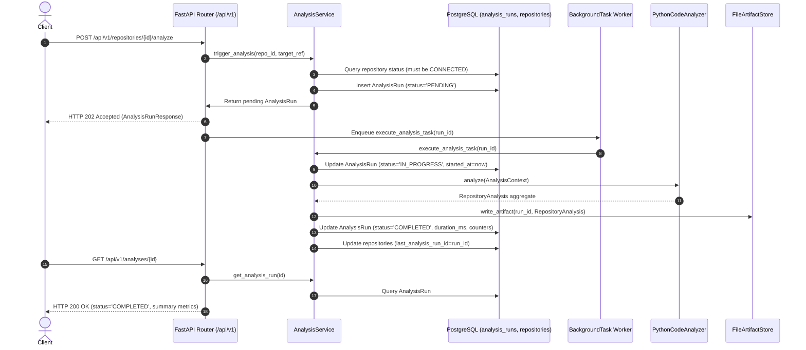

# Technical Implementation Plan: TRACE Phase 2 — F02: Repository / Code Analyzer

**Branch**: `003-repository-code-analyzer` | **Date**: 2026-09-29 | **Spec**: [spec.md](./spec.md)

---

## Summary

TRACE Phase 2 (F02: Repository / Code Analyzer) implements deterministic, offline static code analysis for connected Python repositories. Building directly upon the Phase 1 (F01) project and repository management foundation, F02 scans repositories, prunes excluded directories, parses Python source code via standard library `ast` without executing code, and extracts rich software intelligence: modules, packages, classes, methods, functions, decorators, imports, static calls, API endpoints, configuration lookups, database models/queries, tests, documentation, and external dependencies.

F02 operates strictly without requiring an external LLM. It persists operational run state and summary metrics in PostgreSQL (`analysis_runs`), stores the complete typed `RepositoryAnalysis` domain aggregate as an immutable versioned JSON artifact on disk, exposes asynchronous REST API endpoints (`POST` 202 Accepted, polling status via `GET`), provides a lightweight Streamlit evaluation dashboard in `frontend/app.py`, and outputs structured intelligence tailored for consumption by Phase 3A (F03: Dependency Graph) and Phase 3B (F04: Version / Change Analyzer).

---

## Technical Context

- **Language/Version**: Python 3.12+ (standardized across TRACE backend)
- **Primary Dependencies**:
  - Backend: `fastapi>=0.115.0`, `uvicorn>=0.30.0`, `sqlalchemy>=2.0.35`, `asyncpg>=0.29.0`, `alembic>=1.13.0`, `pydantic-settings>=2.5.0`, `structlog>=24.4.0`
  - Parser & Standard Library: `ast`, `tokenize`, `tomllib` (built-in Python 3.11+)
  - Optional Evaluation UI: `streamlit>=1.38.0` (in `frontend/app.py`, completely decoupled from backend core)
- **Storage**:
  - PostgreSQL 16+ (authoritative state for `AnalysisRun` lifecycle records and summary metrics)
  - Filesystem JSON artifact (`storage/artifacts/analyses/{run_id}.json` for exhaustive AST intelligence)
  - Neo4j writes: **Zero** in F02 (deferred strictly to Phase 3A — F03)
- **Testing**: `pytest`, `pytest-asyncio`, `pytest-cov`, `httpx` (ASGI test client), SQLite in-memory (`aiosqlite`)
- **Target Platform**: Windows, Linux, and macOS developer workstations and containerized environments
- **Project Type**: Async REST Web Service + Static Code Intelligence Engine
- **Performance Goals**: Analyze a standard 100-file repository fixture in under 5.0 seconds; sub-200ms API response time for run status and summary endpoints
- **Constraints**: 100% offline, deterministic execution with zero external network or LLM calls; zero code execution during AST parsing; zero speculative/fabricated relationship edges; strict 5-layer onion architecture

---

## Constitution Check

*GATE: Evaluation against TRACE Constitution principles before implementation.*

| Principle | Conformance Analysis | Status |
|---|---|---|
| **I. Evidence over Hallucination** | All entities and relationships (`IMPORTS`, `CALLS`, `EXTENDS`, `EXPOSES`, `READS`, `WRITES`, `TESTED_BY`, `DOCUMENTED_BY`, `CONFIGURED_BY`) are backed by concrete source coordinates (`SourceLocation`). Ambiguous calls are marked `UNRESOLVED_DYNAMIC` with 0 speculative edges fabricated. | **PASS** |
| **II. Deterministic before Probabilistic** | Primary discovery is strictly static AST analysis via Python standard library `ast`. Zero LLM inference is used for structural extraction. | **PASS** |
| **III. Human-in-the-Loop** | Analyses are explicitly triggered by users via API or UI. Results are queryable and inspectable for human verification. | **PASS** |
| **IV. Explainability and Evidence** | Every discovered symbol, endpoint, config key, and database reference retains its precise file path and 1-indexed line range. | **PASS** |
| **V. Provider Independence** | F02 does not require or depend on any LLM provider or external AI API. | **PASS** |
| **VI. Free-First Architecture** | Entire analysis pipeline runs locally and offline using open standard library tools with 0 API costs. | **PASS** |
| **VII. Testability** | 100% offline test suite using deterministic local Python fixture repositories and in-memory test doubles; zero network calls. | **PASS** |
| **VIII. Explicit Contracts** | Strict separation of domain models (`trace/domain/analysis.py`), ORM entities (`AnalysisRunOrm`), and API schemas (`trace/api/analyses/schemas.py`). | **PASS** |
| **IX. Security & Secret Isolation** | AST parser never executes repository code (`eval`/`exec`/`importlib` forbidden); paths are normalized to POSIX relative paths; structured logs redact credentials. | **PASS** |
| **X. Incremental Delivery** | Strictly delivers F02 static analysis and artifact creation; excludes Neo4j persistence (F03), commit diffing (F04), and impact analysis (F05). | **PASS** |
| **XI. Observability** | Every run produces an `AnalysisRun` record in PostgreSQL with status transitions (`PENDING` → `IN_PROGRESS` → `COMPLETED`/`FAILED`) and structured log events. | **PASS** |
| **XII. Reproducibility** | Re-analyzing the identical repository commit and configuration produces byte-identical entity and relationship outputs. | **PASS** |
| **XIII. Maintainability (YAGNI)** | Uses standard library `ast`, `tokenize`, and `tomllib`; avoids heavy external AST toolkits (Tree-sitter, LibCST) until multi-language needs arise. | **PASS** |
| **XIV. Replaceability** | `CodeAnalyzer` is a runtime-checkable Protocol; `PythonCodeAnalyzer` is an isolated adapter easily swappable for future language parsers. | **PASS** |
| **XV. Backward-Compatible Evolution** | Preserves Phase 0 (`/health`) and F01 (`/projects`, `/repositories`) routes and tests with 0 regressions. | **PASS** |
| **XVI. Production Quality** | Minimum 80% line and branch test coverage, strict `mypy` type annotations, zero Ruff linter warnings. | **PASS** |
| **XVII. No Fabricated State** | Analysis diagnostics accurately record parsing errors; unresolvable symbols are explicitly categorized as unresolvable. | **PASS** |

---

## Project Structure & Architecture Mapping

```text
backend/
├── alembic/versions/
│   ├── 0001_baseline.py                          # Phase 0 baseline
│   ├── 0002_project_repository.py                # F01 projects and repositories
│   └── 0003_analysis_runs.py                     # [NEW] F02 migration: analysis_runs table
├── src/trace/
│   ├── analysis/                                 # [NEW] Analysis engine subsystem
│   │   ├── __init__.py
│   │   ├── analyzer.py                           # PythonCodeAnalyzer implementing CodeAnalyzer
│   │   ├── scanner.py                            # RepositoryScanner: file traversal & exclusion filtering
│   │   ├── parser.py                             # PythonAstParser: ast.parse with fault-tolerant diagnostics
│   │   ├── extractor.py                          # SymbolExtractor: AST visitor for modules, classes, functions
│   │   └── detectors/                            # Specialized pattern detectors
│   │       ├── __init__.py
│   │       ├── service.py                        # [NEW] ServiceDetector: domain/app service extraction
│   │       ├── api.py                            # APIDetector: FastAPI & Flask route extraction
│   │       ├── config.py                         # ConfigDetector: os.environ, BaseSettings, SettingsConfigDict
│   │       ├── database.py                       # DatabaseDetector: SQLAlchemy models, queries, writes
│   │       ├── test.py                           # TestDetector: pytest/unittest detection & TESTED_BY linking
│   │       ├── documentation.py                  # DocumentationDetector: docstrings & README/docs markdown
│   │       └── dependency.py                     # DependencyDetector: pyproject.toml & requirements.txt
│   ├── api/
│   │   ├── router.py                             # [MODIFIED] Register analyses router
│   │   └── analyses/                             # [NEW] Analysis API endpoints & schemas
│   │       ├── __init__.py
│   │       ├── router.py                         # FastAPI routes for /api/v1/analyses and /analyze
│   │       └── schemas.py                        # Pydantic v2 request/response models
│   ├── domain/
│   │   ├── analysis.py                           # [NEW] Pure domain models (RepositoryAnalysis, Symbol, etc.)
│   │   └── exceptions.py                         # [MODIFIED] Add AnalysisRunNotFoundError, AnalysisExecutionError
│   ├── infrastructure/
│   │   ├── database/models/
│   │   │   ├── __init__.py                       # [MODIFIED] Export AnalysisRunOrm
│   │   │   └── analysis_run.py                   # [NEW] SQLAlchemy ORM model for analysis_runs table
│   │   └── storage/                              # [NEW] Artifact storage manager
│   │       ├── __init__.py
│   │       └── artifact_store.py                 # File-based JSON artifact reader/writer
│   ├── services/
│   │   ├── __init__.py                           # [MODIFIED] Export AnalysisService
│   │   └── analysis.py                           # [NEW] AnalysisService orchestrating runs and workers
│   └── main.py                                   # [MODIFIED] Wire AnalysisService in FastAPI lifespan
frontend/
└── app.py                                        # [NEW] Streamlit Internal Analysis Evaluation UI
tests/
├── fixtures/                                     # [NEW] Deterministic test fixtures
│   ├── sample_repo/                              # Standard Python multi-module repository
│   │   ├── pyproject.toml
│   │   ├── README.md
│   │   ├── app/
│   │   │   ├── __init__.py
│   │   │   ├── main.py                           # FastAPI route endpoints
│   │   │   ├── config.py                         # Pydantic BaseSettings & os.environ
│   │   │   ├── models.py                         # SQLAlchemy Base models
│   │   │   └── services.py                       # Classes, inheritance, methods, calls
│   │   └── tests/
│   │       ├── __init__.py
│   │       └── test_services.py                  # Test functions testing services.py
│   ├── syntax_error_repo/                        # Repo with intentional SyntaxError file
│   └── empty_repo/                               # Repo with 0 Python files
├── api/
│   └── test_analysis_api.py                      # [NEW] REST API contract tests for analysis endpoints
├── integration/
│   └── test_analysis_flow.py                     # [NEW] End-to-end integration test (F01 repo -> F02 analysis)
└── unit/
    ├── test_analysis_domain.py                   # [NEW] Pure domain entity tests
    ├── test_repository_scanner.py                # [NEW] Directory exclusion & file inventory tests
    ├── test_python_code_analyzer.py              # [NEW] AST extraction, calls, and imports tests
    ├── test_analysis_detectors.py                # [NEW] Unit tests for all 7 pattern detectors
    └── test_analysis_service.py                  # [NEW] Service lifecycle and persistence tests
```

---

## Detailed Architectural Components

### 1. Repository Scanning & Exclusion Engine (`trace.analysis.scanner`)
- **Class**: `RepositoryScanner`
- **Responsibilities**:
  - Traverses `working_tree_path` using `pathlib.Path`.
  - Prunes default ignored directories at traversal entry: `.git`, `.venv`, `venv`, `env`, `__pycache__`, `.pytest_cache`, `.mypy_cache`, `.ruff_cache`, `build`, `dist`, `*.egg-info`, `node_modules`, `.idea`, `.vscode`.
  - Applies custom glob exclusion patterns from `AnalysisContext.exclude_patterns`.
  - Classifies each discovered file into `FileKind` (`PYTHON`, `TEST`, `CONFIG`, `DOCUMENTATION`, `DEPENDENCY`, `OTHER`).
  - Returns a tuple of `AnalyzedFile` records and candidate Python source paths.

### 2. AST Parsing & Error Diagnostics (`trace.analysis.parser`)
- **Class**: `PythonAstParser`
- **Responsibilities**:
  - Reads Python source files using UTF-8 decoding (falling back to Latin-1 with replacement on byte errors).
  - Parses code via `ast.parse(source, filename=file_path)`.
  - Catches `SyntaxError` and `IndentationError`, capturing line number, column offset, and message into an `AnalysisDiagnostic` with severity `ERROR` and code `SYNTAX_ERROR`.
  - Marks faulty files with status `FileStatus.ERROR` while allowing the scanning pipeline to proceed with remaining files.

### 3. Symbol & Relationship Extractor (`trace.analysis.extractor`)
- **Class**: `SymbolExtractor(ast.NodeVisitor)`
- **Responsibilities**:
  - Maintains scope stacks to generate deterministic, fully qualified symbol names (`<module>.<Class>.<method>`).
  - Extracts `Module` metadata (docstring, package indicator).
  - Extracts `Class` metadata (name, qualified name, base class expressions, decorators, line coordinates).
  - Extracts `Function` metadata (name, parameters, type annotations, return types, decorators, kind).
  - Extracts `Import` statements (imported module, symbol, alias, relative dots, external vs internal classification).
  - Extracts function and method `Call` sites, matching against local symbols and imports to resolve targets, tagging unresolvable dynamic calls as `UNRESOLVED_DYNAMIC`.
  - Creates structural `AnalysisRelationship` records (`IMPORTS`, `CALLS`, `EXTENDS`).

### 4. Specialized Pattern Detectors (`trace.analysis.detectors`)
- **`APIDetector`**: Scans decorators on functions matching `@app.<method>` or `@router.<method>` (FastAPI/Starlette) and `@app.route` (Flask). Extracts HTTP method and path string. Produces `APIEndpoint` and `EXPOSES` relationship.
- **`ConfigDetector`**: Matches `os.environ` accesses and Pydantic `BaseSettings` definitions. Produces `ConfigurationReference` and `CONFIGURED_BY`/`READS` relationships.
- **`DatabaseDetector`**: Matches SQLAlchemy `DeclarativeBase` subclasses, `__tablename__`, and `session.execute/query` call sites. Produces `DatabaseReference` and `READS`/`WRITES` relationships.
- **`TestDetector`**: Identifies test files and test functions. Maps calls and imports from test functions to target symbols, producing `TestReference` and `TESTED_BY` relationships.
- **`DocumentationDetector`**: Extracts docstrings and scans `README.md` and `docs/*.md`. Produces `DocumentationReference` and `DOCUMENTED_BY` relationships.
- **`DependencyDetector`**: Parses `pyproject.toml` (via `tomllib`) and `requirements.txt`. Produces `ExternalDependency` and `DEPENDS_ON` relationships.

### 5. Domain Model & Exceptions (`trace.domain.analysis`, `trace.domain.exceptions`)
- Implements all pure domain models specified in `data-model.md`: `RepositoryAnalysis`, `AnalyzedFile`, `Module`, `Class`, `Function`, `Import`, `Call`, `APIEndpoint`, `ConfigurationReference`, `DatabaseReference`, `TestReference`, `DocumentationReference`, `ExternalDependency`, `AnalysisRelationship`, `AnalysisDiagnostic`, `SourceLocation`.
- Implements `AnalysisRunNotFoundError` (HTTP 404) and `AnalysisExecutionError` (HTTP 500).

### 6. Persistence & Relational Schema (`trace.infrastructure.database`)
- **ORM Model**: `AnalysisRunOrm` in `trace/infrastructure/database/models/analysis_run.py`.
- **Migration**: `0003_analysis_runs.py` creating the `analysis_runs` table with foreign keys to `repositories.id` and `projects.id`.
- **Artifact Store**: `FileArtifactStore` in `trace/infrastructure/storage/artifact_store.py` writing and reading JSON artifacts in `storage/artifacts/analyses/`.

### 7. Service Layer (`trace.services.analysis`)
- **Class**: `AnalysisService`
- **Methods**:
  - `trigger_analysis(repository_id, target_ref, exclude_patterns) -> AnalysisRun`: Validates repository is connected, creates `AnalysisRun` with `PENDING`, dispatches background worker task, returns pending record.
  - `execute_analysis_task(run_id) -> None`: Runs in `FastAPI BackgroundTasks`. Transitions status to `IN_PROGRESS`, acquires working tree path, runs `PythonCodeAnalyzer`, serializes JSON artifact, updates `AnalysisRun` to `COMPLETED`, updates `repositories.last_analysis_run_id`. Handles fatal exceptions by marking status `FAILED`.
  - `get_analysis_run(run_id) -> AnalysisRun`: Fetches operational run status.
  - `list_analysis_runs(repository_id, limit, offset, status) -> tuple[list[AnalysisRun], int]`: Queries runs with pagination.
  - `get_analysis_artifact(run_id) -> RepositoryAnalysis`: Loads JSON artifact for detailed entity/relationship queries.

### 8. API Router & Schemas (`trace.api.analyses`)
- Mounts `/api/v1/repositories/{id}/analyze` and `/api/v1/analyses/*` endpoints.
- Implements strongly typed Pydantic request/response schemas matching `contracts/analysis-api.md`.

### 9. Streamlit Evaluation Interface (`frontend/app.py`)
- Independent Python script using `streamlit`.
- Connects to backend API endpoints (`http://127.0.0.1:8000/api/v1`).
- Provides project/repository dropdown, an "Analyze Repository" trigger button, real-time polling status, summary metric cards, entity tables, and a diagnostics viewer.

---

## Python Analysis Strategy & Resolution Algorithms

### Module & Package Resolution Algorithm
1. Compute relative POSIX path from repository root (or detected source directory `src/`): e.g. `src/pkg/service.py` → `pkg/service.py`.
2. Strip `.py` suffix and replace `/` with `.`: `pkg.service`.
3. If filename is `__init__.py`: Strip `.__init__` to form package name `pkg`, and mark `is_package = True`.
4. If standalone file: e.g. `main.py` → `main`, with `is_package = False`.

### Statically Resolvable Call Algorithm
1. Build local symbol map for current module:
   - All class names: `MyClass` → `<module>.MyClass`
   - All standalone functions: `my_func` → `<module>.my_func`
   - All method names inside class: `my_method` → `<module>.<Class>.my_method`
2. Build import alias map:
   - `from pkg.mod import helper`: `helper` → `pkg.mod.helper`
   - `import pkg.mod as m`: `m` → `pkg.mod`
3. When encountering `ast.Call(func)`:
   - If `func` is `ast.Name(id)`: Look up `id` in local functions, classes, and imported symbols. If found, mark `RESOLVED_INTERNAL` or `RESOLVED_EXTERNAL`.
   - If `func` is `ast.Attribute(value=ast.Name(id="self"), attr=name)` inside a class method: Resolve to `<module>.<CurrentClass>.<attr>` as `RESOLVED_INTERNAL`.
   - If `func` is `ast.Attribute(value=ast.Name(id=alias), attr=name)`: If `alias` is in import map, resolve to `<imported_module>.<name>`.
   - For all other dynamic, chained, or receiver-ambiguous calls (e.g. `obj.run()`, `getattr(...)()`): Record callee expression string, set `resolved_target = None`, and assign `resolution_status = UNRESOLVED_DYNAMIC`.
   - Create `CALLS` relationship **only** when `resolution_status` is `RESOLVED_INTERNAL` or `RESOLVED_EXTERNAL`.

---

## Testing Strategy

### 1. Deterministic Fixture Repository (`tests/fixtures/sample_repo`)
A realistic Python repository containing:
- `pyproject.toml`: Declares `fastapi>=0.115.0`, `pydantic>=2.0.0`, `sqlalchemy>=2.0.0`.
- `README.md`: Root documentation file.
- `app/main.py`: FastAPI application defining `@app.get("/items")` and `@app.post("/items")`.
- `app/config.py`: Settings class subclassing `BaseSettings` reading `DATABASE_URL` via `os.environ`.
- `app/models.py`: SQLAlchemy declarative model `ItemOrm` inheriting `Base` with `__tablename__ = "items"`.
- `app/services.py`: `BaseService` class, `ItemService` inheriting `BaseService` (`EXTENDS`), decorated methods, static function calls to `models.py` and `config.py`.
- `app/tests/test_services.py`: Test functions importing `ItemService` and asserting behavior (`TESTED_BY`).

#### Expected Analyzer Fixture Matrix
| Finding Category | Expected Minimum Count | Verification Target |
|---|---|---|
| Python Files | 5 | `app/main.py`, `app/config.py`, `app/models.py`, `app/services.py`, `app/tests/test_services.py` |
| Modules / Packages | 6 | `app`, `app.main`, `app.config`, `app.models`, `app.services`, `app.tests.test_services` |
| Classes | 3 | `BaseService`, `ItemService`, `ItemOrm` |
| Functions / Methods | 8+ | Route handlers, service methods, test functions |
| Endpoints | 2 | `GET /items`, `POST /items` (`EXPOSES`) |
| Config References | 1+ | `DATABASE_URL` (`CONFIGURED_BY`) |
| Database References | 1+ | `ItemOrm` / `items` (`READS`/`WRITES`) |
| External Dependencies | 3 | `fastapi`, `pydantic`, `sqlalchemy` (`DEPENDS_ON`) |
| Test References | 2+ | `test_item_creation`, etc. (`TESTED_BY`) |
| Relationships | 15+ | `IMPORTS`, `CALLS`, `EXTENDS`, `EXPOSES`, `READS`, `TESTED_BY`, `DEPENDS_ON` |
| Diagnostics | 0 | Clean parse with 0 errors |

### 2. Negative & Edge Case Fixtures
- `tests/fixtures/syntax_error_repo`: Contains `valid.py` and `broken.py` (with deliberate syntax error). Verifies that `valid.py` is parsed, `broken.py` produces an `AnalysisDiagnostic`, run completes with status `COMPLETED`, and diagnostic count = 1.
- `tests/fixtures/empty_repo`: Contains 0 Python files. Verifies that analysis completes with status `COMPLETED`, 0 modules, and 0 errors.
- `tests/fixtures/ignored_dirs_repo`: Contains dummy files inside `.venv/`, `__pycache__/`, and `.git/`. Verifies that scanner skips these directories entirely.

### 3. Test Suites & Quality Verification
- **Unit Tests**:
  - `test_analysis_domain.py`: Verify domain models, value objects, equality, and immutability.
  - `test_repository_scanner.py`: Verify directory traversal, exclusion pruning, and file classification.
  - `test_python_code_analyzer.py`: Verify AST parsing, qualified names, decorators, inheritance, and call resolution.
  - `test_analysis_detectors.py`: Verify each of the 7 detectors individually against targeted AST code snippets.
  - `test_analysis_service.py`: Verify lifecycle transitions, persistence, and error handling using test doubles.
- **API Tests (`test_analysis_api.py`)**:
  - Contract testing for all `/api/v1/analyses/*` endpoints (status codes, response bodies, pagination, query filtering).
- **Integration Tests (`test_analysis_flow.py`)**:
  - End-to-end integration: Register repository via F01 → Trigger analysis via F02 → Poll completion → Verify PostgreSQL row & JSON artifact.
- **Regression Protection**:
  - All existing Phase 0 and F01 tests and all F02 tests must remain green with zero failures.

---

## Integration Strategy: F01 to F02



---

## Non-Goals (Strict Phase Boundaries)

To prevent scope creep and maintain architectural integrity, the following are strictly **OUT OF SCOPE** for F02:
- **Neo4j Graph Database Persistence / Cypher Queries**: Owned exclusively by Phase 3A (F03: Dependency Graph).
- **Version-to-Version Diffing / Semantic Change Evaluation**: Owned exclusively by Phase 3B (F04: Version / Change Analyzer).
- **Change Impact Propagation & Blast-Radius Calculation**: Owned by Phase 4 (F05/F06).
- **Automated Upgrade Planning**: Owned by Phase 5 (F07).
- **LLM-Based Semantic Reasoning or Chat Assistant**: F02 operates 100% offline via static analysis.
- **Production React Observatory**: Streamlit in `frontend/app.py` serves strictly as an internal evaluation tool; React Observatory is Phase 8.
