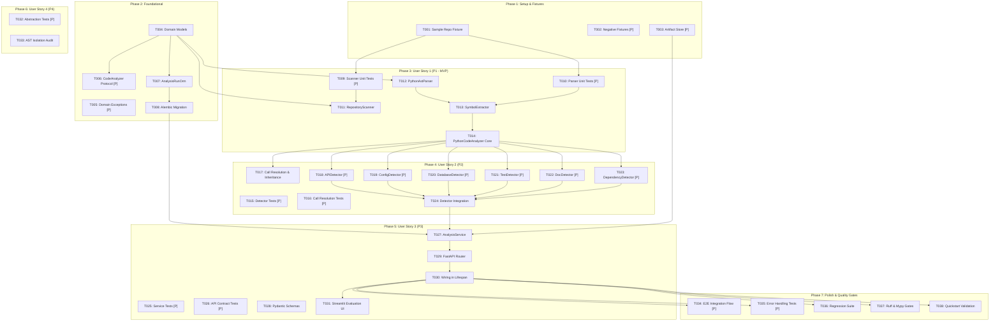

# Tasks: TRACE Phase 2 — F02: Repository / Code Analyzer

**Feature Branch**: `003-repository-code-analyzer`  
**Specification**: [`specs/003-repository-code-analyzer/spec.md`](./spec.md)  
**Implementation Plan**: [`specs/003-repository-code-analyzer/plan.md`](./plan.md)  
**Data Model**: [`specs/003-repository-code-analyzer/data-model.md`](./data-model.md)  
**Contracts**: [`specs/003-repository-code-analyzer/contracts/`](./contracts/)

---

## Phase 1: Setup & Deterministic Fixtures

**Purpose**: Establish deterministic fixture repositories and artifact storage infrastructure.

- [X] T001 Create deterministic multi-module fixture repository in `backend/tests/fixtures/sample_repo/`
  - **Objective**: Provide a realistic, reproducible Python codebase fixture for static code analysis testing.
  - **Files**: `backend/tests/fixtures/sample_repo/pyproject.toml`, `README.md`, `app/__init__.py`, `app/main.py`, `app/config.py`, `app/models.py`, `app/services.py`, `app/tests/__init__.py`, `app/tests/test_services.py`
  - **Dependency**: None
  - **Implementation Requirement**: Include FastAPI routes (`@app.get`, `@app.post`), Pydantic `BaseSettings`, SQLAlchemy declarative `ItemOrm`, class inheritance (`ItemService` extends `BaseService`), method calls, decorators, docstrings, and pytest test functions.
  - **Test Requirement**: Fixture directory can be traversed and parsed by Python standard tools.
  - **Acceptance Condition**: All fixture files exist and contain valid Python 3.12 syntax.

- [X] T002 [P] Create negative and boundary test fixtures in `backend/tests/fixtures/`
  - **Objective**: Provide failure-path fixtures for syntax errors, empty repositories, and ignored directories.
  - **Files**: `backend/tests/fixtures/syntax_error_repo/valid.py`, `broken.py`, `backend/tests/fixtures/empty_repo/`, `backend/tests/fixtures/ignored_dirs_repo/.venv/dummy.py`, `__pycache__/dummy.pyc`
  - **Dependency**: None
  - **Implementation Requirement**: `syntax_error_repo/broken.py` must contain an intentional `SyntaxError` (e.g. unclosed parenthesis); `empty_repo` must contain 0 Python files; `ignored_dirs_repo` must contain dummy files in `.venv` and `__pycache__`.
  - **Test Requirement**: Files exist in expected fixture locations.
  - **Acceptance Condition**: Fixtures trigger expected scanner and parser branch conditions during tests.

- [X] T003 [P] Implement file artifact store in `backend/src/trace/infrastructure/storage/artifact_store.py`
  - **Objective**: Manage reading and writing immutable versioned JSON artifacts for `RepositoryAnalysis`.
  - **Files**: `backend/src/trace/infrastructure/storage/artifact_store.py`, `backend/src/trace/infrastructure/storage/__init__.py`
  - **Dependency**: None
  - **Implementation Requirement**: Implement `FileArtifactStore` with async/sync `write_artifact(run_id, analysis_dict)` and `read_artifact(run_id)` creating parent directories under `storage/artifacts/analyses/`.
  - **Test Requirement**: Unit tests verify writing and reading JSON artifacts with UTF-8 encoding.
  - **Acceptance Condition**: Artifacts are correctly persisted and deserialized without data loss.

---

## Phase 2: Foundational (Domain Entities, Protocols & Persistence Schema)

**Purpose**: Core domain models, protocols, and database schema that MUST be completed before any user story implementation.

- [X] T004 Implement F02 pure domain models and enums in `backend/src/trace/domain/analysis.py`
  - **Objective**: Establish strongly typed, immutable domain models for all code intelligence concepts.
  - **Files**: `backend/src/trace/domain/analysis.py`, `backend/src/trace/domain/__init__.py`
  - **Dependency**: None
  - **Implementation Requirement**: Define frozen dataclasses and StrEnums for `SourceLocation`, `AnalyzedFile`, `Module`, `Class`, `Function`, `Import`, `Call`, `APIEndpoint`, `ConfigurationReference`, `DatabaseReference`, `TestReference`, `DocumentationReference`, `ExternalDependency`, `AnalysisRelationship`, `AnalysisDiagnostic`, and root aggregate `RepositoryAnalysis` with zero framework or I/O imports per Constitution §XIV.
  - **Test Requirement**: Unit tests in `backend/tests/unit/test_analysis_domain.py` verify immutability, fields, and default values.
  - **Acceptance Condition**: Domain models instantiate cleanly and satisfy all field types defined in `data-model.md`.

- [X] T005 [P] Add F02 domain exceptions in `backend/src/trace/domain/exceptions.py`
  - **Objective**: Define typed domain exceptions for analysis run lifecycle and execution failures.
  - **Files**: `backend/src/trace/domain/exceptions.py`
  - **Dependency**: None
  - **Implementation Requirement**: Add `AnalysisRunNotFoundError` (inheriting `NotFoundError`), `AnalysisExecutionError` (inheriting `TraceDomainError`), and `InvalidAnalysisStateError` (inheriting `ConflictError`).
  - **Test Requirement**: Exceptions raise with descriptive messages and format strings.
  - **Acceptance Condition**: Exceptions are available for import across services and API layers.

- [X] T006 [P] Define `CodeAnalyzer` protocol and `AnalysisContext` in `backend/src/trace/analysis/analyzer.py`
  - **Objective**: Define the language-agnostic interface boundary isolating parser engines from business logic.
  - **Files**: `backend/src/trace/analysis/analyzer.py`, `backend/src/trace/analysis/__init__.py`
  - **Dependency**: T004
  - **Implementation Requirement**: Define `AnalysisContext` dataclass and `@runtime_checkable` `CodeAnalyzer(Protocol)` with `supported_language` property and `analyze(context: AnalysisContext) -> RepositoryAnalysis` method.
  - **Test Requirement**: Protocol check passes with `isinstance()` on conforming classes.
  - **Acceptance Condition**: Contract matches `contracts/code-analyzer.md`.

- [X] T007 Implement `AnalysisRunOrm` in `backend/src/trace/infrastructure/database/models/analysis_run.py`
  - **Objective**: Create the SQLAlchemy 2.x declarative ORM model mapping to the `analysis_runs` relational table.
  - **Files**: `backend/src/trace/infrastructure/database/models/analysis_run.py`, `backend/src/trace/infrastructure/database/models/__init__.py`
  - **Dependency**: T004
  - **Implementation Requirement**: Inherit from `Base`. Define columns: `id`, `repository_id` (authoritative FK to `repositories.id`), `project_id` (FK to `projects.id`), `status`, `target_ref`, `resolved_revision` (VARCHAR(40) exact commit SHA), `commit_hash`, `started_at`, `completed_at`, `duration_ms`, counters (`total_files`, `python_files`, `total_modules`, `total_classes`, `total_functions`, `total_relationships`, `total_diagnostics`), `error_message`, `artifact_path`, `created_at`, `updated_at`. Include `to_domain()` helper.
  - **Test Requirement**: Model compiles with SQLAlchemy declarative registry.
  - **Acceptance Condition**: Schema matches `data-model.md` PostgreSQL definition.

- [X] T008 Create Alembic migration script in `backend/alembic/versions/0003_analysis_runs.py`
  - **Objective**: Add `analysis_runs` table to PostgreSQL with foreign keys and indexes.
  - **Files**: `backend/alembic/versions/0003_analysis_runs.py`
  - **Dependency**: T007
  - **Implementation Requirement**: Generate migration chained from `0002_project_repository.py`. Include both `upgrade()` and `downgrade()` functions. Add indexes on `(repository_id, created_at DESC)` and `status`.
  - **Test Requirement**: Run `alembic upgrade head` and `alembic downgrade -1` against test database.
  - **Acceptance Condition**: Migration applies and reverts cleanly without orphaned objects.

---

## Phase 3: User Story 1 - Deterministic Source Code & Structural Discovery (Priority: P1) 🎯 MVP

**Goal**: Discover files, prune ignored directories, parse Python source code via standard library `ast`, and extract modules, packages, classes, methods, functions, decorators, and imports into a structured intelligence model.

**Independent Test**: Execute `PythonCodeAnalyzer` against `backend/tests/fixtures/sample_repo/`. Verify that all Python files are inventoried, modules/packages are resolved, classes and functions are extracted with exact line coordinates, and decorators/imports are accurately cataloged with zero external network or LLM calls.

### Tests for User Story 1
- [X] T009 [P] [US1] Create unit tests for `RepositoryScanner` in `backend/tests/unit/test_repository_scanner.py`
  - **Objective**: Verify file traversal, directory pruning, and file type classification.
  - **Files**: `backend/tests/unit/test_repository_scanner.py`
  - **Dependency**: T001, T002, T004
  - **Implementation Requirement**: Test default pruning (`.git`, `.venv`, `__pycache__`), custom exclusion patterns, and classification of Python, test, config, doc, and dependency files.
  - **Test Requirement**: Tests execute in <50ms using fixture directories.
  - **Acceptance Condition**: Tests verify that 100% of ignored paths are skipped and valid files are cataloged.

- [X] T010 [P] [US1] Create unit tests for Python AST parsing and symbol extraction in `backend/tests/unit/test_python_code_analyzer.py`
  - **Objective**: Verify AST parsing of modules, classes, functions, methods, decorators, and imports.
  - **Files**: `backend/tests/unit/test_python_code_analyzer.py`
  - **Dependency**: T001, T004, T006
  - **Implementation Requirement**: Test extraction of qualified names, line numbers, decorators with arguments, parameter descriptors, and import kinds (`IMPORT` vs `IMPORT_FROM`).
  - **Test Requirement**: Tests run against code snippets and `sample_repo/`.
  - **Acceptance Condition**: Extracted symbols match exact AST line numbers and expected signatures.

### Implementation for User Story 1
- [X] T011 [US1] Implement `RepositoryScanner` in `backend/src/trace/analysis/scanner.py`
  - **Objective**: Provide deterministic directory traversal with early directory pruning, source root discovery, and file safety checks.
  - **Files**: `backend/src/trace/analysis/scanner.py`
  - **Dependency**: T004
  - **Implementation Requirement**: Implement `RepositoryScanner.scan(root_path, exclude_patterns)` using `pathlib.Path`. Prune default ignored sets before recursing. Detect source roots (`src/` layout vs root package). Check file safety: skip binary files (null-byte heuristic), mark files >1MB as `SKIPPED`, and verify symlink targets remain inside repository boundaries. Sort file paths alphabetically. Classify file kinds into `FileKind` and return `tuple[AnalyzedFile, ...]`.
  - **Test Requirement**: Passes `backend/tests/unit/test_repository_scanner.py`.
  - **Acceptance Condition**: Scans `sample_repo/` discovering expected Python and non-Python files while strictly skipping ignored folders and safely handling oversized/binary files.

- [X] T012 [US1] Implement `PythonAstParser` in `backend/src/trace/analysis/parser.py`
  - **Objective**: Parse Python source files into standard library `ast.AST` with fault-tolerant error capture.
  - **Files**: `backend/src/trace/analysis/parser.py`
  - **Dependency**: T004
  - **Implementation Requirement**: Implement `PythonAstParser.parse_file(file_path)` using UTF-8 reading with fallback decoding. Parse with `ast.parse()`. Catch `SyntaxError` and `IndentationError`, returning an `AnalysisDiagnostic` and `None` on failure.
  - **Test Requirement**: Unit test verifies syntax error in `broken.py` produces `AnalysisDiagnostic` with exact line and column.
  - **Acceptance Condition**: Never crashes the calling process on invalid syntax; always returns valid AST or structured diagnostic.

- [X] T013 [US1] Implement `SymbolExtractor` in `backend/src/trace/analysis/extractor.py`
  - **Objective**: Traverse AST to extract modules, classes, functions, methods, parameters, decorators, and imports.
  - **Files**: `backend/src/trace/analysis/extractor.py`
  - **Dependency**: T004, T012
  - **Implementation Requirement**: Implement `ast.NodeVisitor` subclass tracking module and class nesting scopes. Extract docstrings (`ast.get_docstring`), decorators (capturing expression string and parsed arguments), parameter defaults and type annotations, and import statements (with relative dot counting and internal vs external classification). Handle PEP 420 namespace packages without `__init__.py`.
  - **Test Requirement**: Passes `backend/tests/unit/test_python_code_analyzer.py`.
  - **Acceptance Condition**: Extracted entities contain valid `SourceLocation` records with 1-indexed start and end lines.

- [X] T014 [US1] Implement `PythonCodeAnalyzer` core engine in `backend/src/trace/analysis/analyzer.py`
  - **Objective**: Wire scanner, parser, and extractor into the concrete `PythonCodeAnalyzer` class implementing `CodeAnalyzer`.
  - **Files**: `backend/src/trace/analysis/analyzer.py`
  - **Dependency**: T006, T011, T012, T013
  - **Implementation Requirement**: Implement `analyze(context: AnalysisContext) -> RepositoryAnalysis`. Traverse files from `RepositoryScanner`, parse each Python file with `PythonAstParser`, extract symbols with `SymbolExtractor`, attach `context.resolved_revision`, and assemble initial `RepositoryAnalysis` aggregate.
  - **Test Requirement**: Test against `sample_repo/` verifying file, module, class, and function counts.
  - **Acceptance Condition**: Satisfies SC-001, SC-002, and SC-003.

---

## Phase 4: User Story 2 - Relationship & Reference Extraction (Priority: P2)

**Goal**: Extract structural relationships (`IMPORTS`, `CALLS`, `EXTENDS`, `EXPOSES`, `READS`, `WRITES`, `TESTED_BY`, `DOCUMENTED_BY`, `CONFIGURED_BY`, `DEPENDS_ON`) with inspectable source evidence without fabricating speculative edges.

**Independent Test**: Run analyzer against `sample_repo/` and verify that all cross-module function calls, route endpoint decorators, settings accesses, database queries, and test targets are linked with valid `evidence_location` records.

### Tests for User Story 2
- [X] T015 [P] [US2] Create detector unit tests in `backend/tests/unit/test_analysis_detectors.py`
  - **Objective**: Test each specialized pattern detector against isolated code snippets.
  - **Files**: `backend/tests/unit/test_analysis_detectors.py`
  - **Dependency**: T004, T014
  - **Implementation Requirement**: Test `APIDetector` (FastAPI `@app.get` & Flask `@bp.route`), `ConfigDetector` (`os.environ` & `BaseSettings`), `DatabaseDetector` (SQLAlchemy models & queries), `TestDetector` (pytest functions), `DocumentationDetector` (docstrings & README), `DependencyDetector` (`pyproject.toml` dependencies).
  - **Test Requirement**: Tests assert exact extracted values, endpoints, and table names.
  - **Acceptance Condition**: 100% of pattern detection test cases pass.

- [X] T016 [P] [US2] Create call resolution and inheritance tests in `backend/tests/unit/test_relationship_synthesis.py`
  - **Objective**: Test static call resolution, ambiguous dynamic call handling, and class inheritance hierarchies.
  - **Files**: `backend/tests/unit/test_relationship_synthesis.py`
  - **Dependency**: T004, T014
  - **Implementation Requirement**: Verify that resolvable internal/external calls produce `CALLS` relationships, `self.method()` resolves within class, base classes produce `EXTENDS`, and dynamic calls (`getattr(...)()`, `obj.foo()`) produce `UNRESOLVED_DYNAMIC` with 0 speculative edges.
  - **Test Requirement**: Tests verify `Call.resolution_status` and resulting `AnalysisRelationship` edges.
  - **Acceptance Condition**: No unbacked call edges exist in test outputs.

### Implementation for User Story 2
- [X] T017 [US2] Implement static call resolution and `CALLS`/`EXTENDS` relationship linking in `backend/src/trace/analysis/extractor.py`
  - **Objective**: Build module-level symbol and import maps to resolve call targets statically.
  - **Files**: `backend/src/trace/analysis/extractor.py`
  - **Dependency**: T013, T016
  - **Implementation Requirement**: Implement symbol lookup matching `ast.Call` nodes against local definitions and imported names. Mark calls as `RESOLVED_INTERNAL`, `RESOLVED_EXTERNAL`, or `UNRESOLVED_DYNAMIC`. Create `CALLS` relationships only for resolved calls. Create `EXTENDS` relationships linking derived classes to base classes.
  - **Test Requirement**: Passes `test_relationship_synthesis.py`.
  - **Acceptance Condition**: Conforms strictly to Constitution §I (*Evidence over Hallucination*).

- [X] T018 [P] [US2] Implement `APIDetector` in `backend/src/trace/analysis/detectors/api.py`
  - **Objective**: Statically detect web API endpoints and synthesize `EXPOSES` relationships.
  - **Files**: `backend/src/trace/analysis/detectors/api.py`, `backend/src/trace/analysis/detectors/__init__.py`
  - **Dependency**: T004, T013
  - **Implementation Requirement**: Inspect decorators for FastAPI (`@app.<method>`, `@router.<method>`) and Flask (`@app.route`, `@bp.route`). Extract HTTP method and route path string. Emit `APIEndpoint` and `EXPOSES` relationship linking handler function to endpoint.
  - **Test Requirement**: Passes API detector unit tests in `test_analysis_detectors.py`.
  - **Acceptance Condition**: Successfully discovers `/items` routes in `sample_repo/app/main.py`.

- [X] T019 [P] [US2] Implement `ConfigDetector` in `backend/src/trace/analysis/detectors/config.py`
  - **Objective**: Statically detect configuration references and settings usage.
  - **Files**: `backend/src/trace/analysis/detectors/config.py`
  - **Dependency**: T004, T013
  - **Implementation Requirement**: Match AST nodes for `os.environ[...]`, `os.getenv(...)`, and Pydantic `BaseSettings` fields. Emit `ConfigurationReference` and `CONFIGURED_BY`/`READS` relationships.
  - **Test Requirement**: Passes config detector unit tests in `test_analysis_detectors.py`.
  - **Acceptance Condition**: Successfully identifies `DATABASE_URL` reference in `sample_repo/app/config.py`.

- [X] T020 [P] [US2] Implement `DatabaseDetector` in `backend/src/trace/analysis/detectors/database.py`
  - **Objective**: Statically detect database models, tables, and session operations.
  - **Files**: `backend/src/trace/analysis/detectors/database.py`
  - **Dependency**: T004, T013
  - **Implementation Requirement**: Identify classes inheriting from `Base`/`DeclarativeBase` or defining `__tablename__`. Identify `session.execute(...)`, `session.query(...)`, `session.add(...)`, `session.delete(...)` call sites. Emit `DatabaseReference` and `READS`/`WRITES` relationships.
  - **Test Requirement**: Passes database detector unit tests in `test_analysis_detectors.py`.
  - **Acceptance Condition**: Successfully identifies `ItemOrm` / `items` in `sample_repo/app/models.py`.

- [X] T021 [P] [US2] Implement `TestDetector` in `backend/src/trace/analysis/detectors/test.py`
  - **Objective**: Statically identify test suites and map `TESTED_BY` relationships.
  - **Files**: `backend/src/trace/analysis/detectors/test.py`
  - **Dependency**: T004, T013
  - **Implementation Requirement**: Classify files matching `test_*.py` / `*_test.py` or located in `tests/`. Identify test functions and methods. Inspect imports and calls within test functions to link target symbols via `TESTED_BY` relationships.
  - **Test Requirement**: Passes test detector unit tests in `test_analysis_detectors.py`.
  - **Acceptance Condition**: Successfully maps `test_services.py` to `ItemService` in `sample_repo/`.

- [X] T022 [P] [US2] Implement `DocumentationDetector` in `backend/src/trace/analysis/detectors/documentation.py`
  - **Objective**: Extract docstrings and repository markdown documentation.
  - **Files**: `backend/src/trace/analysis/detectors/documentation.py`
  - **Dependency**: T004, T013
  - **Implementation Requirement**: Extract docstrings from modules, classes, and functions. Catalog markdown files (`README.md`, `docs/*.md`). Emit `DocumentationReference` and `DOCUMENTED_BY` relationships.
  - **Test Requirement**: Passes documentation detector unit tests in `test_analysis_detectors.py`.
  - **Acceptance Condition**: Catalogs `README.md` and module docstrings in `sample_repo/`.

- [X] T023 [P] [US2] Implement `DependencyDetector` in `backend/src/trace/analysis/detectors/dependency.py`
  - **Objective**: Deterministically parse dependency manifests and create `DEPENDS_ON` relationships.
  - **Files**: `backend/src/trace/analysis/detectors/dependency.py`
  - **Dependency**: T004
  - **Implementation Requirement**: Parse `pyproject.toml` (using `tomllib`) extracting `[project.dependencies]`, `[project.optional-dependencies]`, and `[tool.poetry.dependencies]`. Parse `requirements.txt` via regex extracting package names and version specifiers. Emit `ExternalDependency` and `DEPENDS_ON` relationships.
  - **Test Requirement**: Passes dependency detector unit tests in `test_analysis_detectors.py`.
  - **Acceptance Condition**: Extracts `fastapi`, `pydantic`, and `sqlalchemy` from `sample_repo/pyproject.toml`.

- [X] T023a [P] [US2] Implement `ServiceDetector` in `backend/src/trace/analysis/detectors/service.py`
  - **Objective**: Statically detect domain and application service classes and methods.
  - **Files**: `backend/src/trace/analysis/detectors/service.py`
  - **Dependency**: T004, T013
  - **Implementation Requirement**: Inspect AST class definitions for `*Service` suffix naming, inheritance from service base classes, or `@service` decorator markers. Extract service kind (`CLASS_SERVICE` vs `FUNCTIONAL_SERVICE`), public methods, and coordinates. Emit `Service` entities.
  - **Test Requirement**: Passes service detector unit tests in `test_analysis_detectors.py`.
  - **Acceptance Condition**: Discovers `BaseService` and `ItemService` in `sample_repo/app/services.py`.

- [X] T024 [US2] Integrate detectors into `PythonCodeAnalyzer` in `backend/src/trace/analysis/analyzer.py`
  - **Objective**: Execute all detectors during repository analysis and assemble the complete `RepositoryAnalysis` model.
  - **Files**: `backend/src/trace/analysis/analyzer.py`
  - **Dependency**: T014, T017, T018, T019, T020, T021, T022, T023, T023a
  - **Implementation Requirement**: Run all specialized detectors after AST parsing and symbol extraction. Aggregate all code entities, relationships, diagnostics, and summary counters into the final `RepositoryAnalysis` object.
  - **Test Requirement**: Run analyzer against `sample_repo/` and verify counts match the expected fixture matrix.
  - **Acceptance Condition**: All inspectable structural relationships and external dependencies in `sample_repo/` are accurately produced with concrete source coordinates (Constitution §I).

---

## Phase 5: User Story 3 - Observable Analysis Lifecycle, REST API & Diagnostics (Priority: P3)

**Goal**: Expose asynchronous analysis initiation via REST API (`POST` 202 Accepted), persist `AnalysisRun` state in PostgreSQL, save JSON artifacts on disk, provide query/polling endpoints, collect structured diagnostics without crashing on syntax errors, and supply a Streamlit evaluation interface.

**Independent Test**: Send `POST /api/v1/repositories/{id}/analyze` for a registered repository. Observe `HTTP 202 Accepted` response. Poll `GET /api/v1/analyses/{id}` until status is `COMPLETED`. Query `/summary`, `/entities`, `/relationships`, and `/diagnostics` to verify all findings are retrievable.

### Tests for User Story 3
- [X] T025 [P] [US3] Create unit tests for `AnalysisService` in `backend/tests/unit/test_analysis_service.py`
  - **Objective**: Verify analysis run lifecycle, status transitions, artifact saving, and error handling.
  - **Files**: `backend/tests/unit/test_analysis_service.py`
  - **Dependency**: T003, T007, T014
  - **Implementation Requirement**: Use in-memory SQLite database gateway and mock `CodeAnalyzer`. Test `trigger_analysis`, background task execution, status progression (`PENDING` → `IN_PROGRESS` → `COMPLETED`/`FAILED`), and `repositories.last_analysis_run_id` update.
  - **Test Requirement**: Service tests achieve >85% code coverage.
  - **Acceptance Condition**: Status transitions and failure logging match design specifications.

- [X] T026 [P] [US3] Create API contract tests in `backend/tests/api/test_analysis_api.py`
  - **Objective**: Verify HTTP status codes, headers, and request/response schema payloads for all analysis routes.
  - **Files**: `backend/tests/api/test_analysis_api.py`
  - **Dependency**: T004, T005
  - **Implementation Requirement**: Test `POST /api/v1/repositories/{id}/analyze` (202 Accepted), `GET /api/v1/analyses/{id}` (200 OK), `/summary` (200 OK), `/entities` (200 OK with `kind` filter), `/relationships` (200 OK with `type` filter), `/diagnostics` (200 OK with `severity` filter), and negative cases (404 Not Found, 409 Archived Project).
  - **Test Requirement**: Uses FastAPI `TestClient` / `httpx.AsyncClient`.
  - **Acceptance Condition**: All endpoint contracts match `contracts/analysis-api.md`.

### Implementation for User Story 3
- [X] T027 [US3] Implement `AnalysisService` in `backend/src/trace/services/analysis.py`
  - **Objective**: Coordinate analysis run persistence, working tree acquisition, background worker execution, and artifact storage.
  - **Files**: `backend/src/trace/services/analysis.py`, `backend/src/trace/services/__init__.py`
  - **Dependency**: T003, T007, T014, T025
  - **Implementation Requirement**: Implement `trigger_analysis` (validates repository is connected, project is active, creates `AnalysisRunOrm` with `PENDING`, dispatches execution via `AnalysisExecutor`), `execute_analysis_task` (updates to `IN_PROGRESS`, acquires working tree and exact commit SHA via `git_provider.acquire_workspace`, runs analyzer, writes artifact JSON via `FileArtifactStore`, updates to `COMPLETED` and updates `repositories.last_analysis_run_id`), `get_analysis_run`, `list_analysis_runs`, and `get_analysis_artifact`.
  - **Test Requirement**: Passes `backend/tests/unit/test_analysis_service.py`.
  - **Acceptance Condition**: Analysis lifecycle state transitions are fully recorded in PostgreSQL.

- [X] T028 [US3] Implement Pydantic v2 schemas in `backend/src/trace/api/analyses/schemas.py`
  - **Objective**: Define strongly typed request and response schemas for all analysis endpoints.
  - **Files**: `backend/src/trace/api/analyses/schemas.py`, `backend/src/trace/api/analyses/__init__.py`
  - **Dependency**: T004
  - **Implementation Requirement**: Define `AnalysisTriggerRequest`, `AnalysisRunResponse`, `AnalysisSummaryResponse`, `EntityItem`, `EntityListResponse`, `RelationshipItem`, `RelationshipListResponse`, `DiagnosticItem`, `DiagnosticListResponse`. Enforce ISO 8601 UTC timestamp formatting.
  - **Test Requirement**: Schema validation tests verify field constraints and serialization.
  - **Acceptance Condition**: Payloads validate cleanly and match `contracts/analysis-api.md`.

- [X] T029 [US3] Implement FastAPI router in `backend/src/trace/api/analyses/router.py`
  - **Objective**: Expose REST endpoints for analysis initiation, status polling, and inspection.
  - **Files**: `backend/src/trace/api/analyses/router.py`
  - **Dependency**: T027, T028
  - **Implementation Requirement**: Implement `POST /api/v1/repositories/{id}/analyze` using `BackgroundTasksAnalysisExecutor` (implementing `AnalysisExecutor`) returning 202 Accepted, `GET /api/v1/repositories/{id}/analyses`, `GET /api/v1/analyses/{id}`, `GET /api/v1/analyses/{id}/summary`, `GET /api/v1/analyses/{id}/entities`, `GET /api/v1/analyses/{id}/relationships`, `GET /api/v1/analyses/{id}/diagnostics`.
  - **Test Requirement**: Passes `backend/tests/api/test_analysis_api.py`.
  - **Acceptance Condition**: All endpoints return expected HTTP status codes and response bodies.

- [X] T030 [US3] Wire router and services in `backend/src/trace/api/router.py` and `backend/src/trace/main.py`
  - **Objective**: Register analysis routes under `/api/v1` and instantiate `AnalysisService` in lifespan composition root.
  - **Files**: `backend/src/trace/api/router.py`, `backend/src/trace/main.py`
  - **Dependency**: T029
  - **Implementation Requirement**: Include `analyses_router` in `api_router`. Wire `PythonCodeAnalyzer`, `FileArtifactStore`, and `AnalysisService` in `main.py` lifespan context and dependency injection functions.
  - **Test Requirement**: Server starts cleanly and OpenAPI documentation at `/docs` displays all new analysis routes.
  - **Acceptance Condition**: Endpoints are accessible on live ASGI server.

- [X] T031 [US3] Implement Streamlit evaluation UI in `frontend/app.py`
  - **Objective**: Provide an internal analysis evaluation dashboard to demonstrate F02 capabilities.
  - **Files**: `frontend/app.py`
  - **Dependency**: T030
  - **Implementation Requirement**: Build a Streamlit dashboard showing: repository selector, "Analyze" button, live status poller (`PENDING` → `COMPLETED`), metric cards (total files, python files, modules, classes, functions, endpoints, tests, dependencies), discovered symbols table, and diagnostics drawer. Keep frontend completely decoupled from backend codebase.
  - **Test Requirement**: App runs via `streamlit run frontend/app.py` without syntax errors.
  - **Acceptance Condition**: Accurately displays analysis progress and summary results from the backend API.

---

## Phase 6: User Story 4 - Multi-Language Analyzer Abstraction Verification (Priority: P4)

**Goal**: Verify that the `CodeAnalyzer` protocol cleanly decouples domain logic, services, and API layers from language-specific AST mechanics, enabling future language additions without refactoring.

**Independent Test**: Substitute `PythonCodeAnalyzer` with a dummy test double implementing `CodeAnalyzer` in service tests. Verify that `AnalysisService` and API endpoints execute without modifications or failures.

- [X] T032 [P] [US4] Create abstraction and replaceability tests in `backend/tests/unit/test_analyzer_abstraction.py`
  - **Objective**: Confirm that `CodeAnalyzer` protocol satisfies Constitution §XIV (*Replaceability*).
  - **Files**: `backend/tests/unit/test_analyzer_abstraction.py`
  - **Dependency**: T006, T027
  - **Implementation Requirement**: Create a mock/stub analyzer implementing `CodeAnalyzer`. Run `AnalysisService` using the stub analyzer and verify that `RepositoryAnalysis` is persisted and returned without Python-specific assumptions.
  - **Test Requirement**: Test passes without importing `PythonCodeAnalyzer` or `ast`.
  - **Acceptance Condition**: Demonstrates complete independence of service layer from concrete language parsing.

- [X] T033 [US4] Audit AST isolation and verify zero AST node leakage
  - **Objective**: Ensure no standard library `ast.AST` nodes or parser internals are exposed outside `backend/src/trace/analysis/`.
  - **Files**: `backend/src/trace/analysis/`, `backend/src/trace/domain/`, `backend/src/trace/api/`
  - **Dependency**: T014, T024, T027
  - **Implementation Requirement**: Verify via static inspection and type checker that domain models and API schemas import only pure dataclasses and primitives, with zero imports of `ast`.
  - **Test Requirement**: Automated test scans module imports ensuring `ast` is imported only inside `trace.analysis.*`.
  - **Acceptance Condition**: Zero `ast` types exposed in public signatures of `domain/` or `api/`.

---

## Phase 7: Polish, Quality Gates & Regression Verification

**Purpose**: Execute end-to-end integration tests, negative failure-path tests, regression checks, formatting, and type-checking gates.

- [X] T034 [P] Implement end-to-end integration test in `backend/tests/integration/test_analysis_flow.py`
  - **Objective**: Validate the full journey: Project creation → Repository registration → Connectivity validation → F02 Static Analysis → Polling → Artifact verification.
  - **Files**: `backend/tests/integration/test_analysis_flow.py`
  - **Dependency**: T030
  - **Implementation Requirement**: Use `httpx.AsyncClient` against running app with test database. Trigger analysis against `sample_repo/`. Poll until `COMPLETED`. Assert that `AnalysisRunOrm` row exists, `last_analysis_run_id` is updated on the repository, and the JSON artifact exists on disk with expected symbol counts.
  - **Test Requirement**: Integration test marked `@pytest.mark.integration` runs cleanly with live database.
  - **Acceptance Condition**: Proves complete end-to-end integration of F01 and F02.

- [X] T035 [P] Create error-handling and partial analysis tests in `backend/tests/unit/test_analysis_errors.py`
  - **Objective**: Verify that repository corruption, syntax errors, and empty repositories produce expected diagnostics.
  - **Files**: `backend/tests/unit/test_analysis_errors.py`
  - **Dependency**: T002, T014, T027
  - **Implementation Requirement**: Test `syntax_error_repo/` (asserts `valid.py` is parsed, `broken.py` produces `AnalysisDiagnostic`, run completes `COMPLETED`), `empty_repo/` (completes `COMPLETED` with 0 modules), and non-existent repository path (terminates with `FAILED` and error message).
  - **Test Requirement**: Asserts exact error codes and non-crashing behavior.
  - **Acceptance Condition**: Satisfies SC-005.

- [X] T036 Run regression suite ensuring existing Phase 0 and F01 tests remain green
  - **Objective**: Guarantee zero regressions on existing baseline.
  - **Files**: `backend/tests/`
  - **Dependency**: T030, T034
  - **Implementation Requirement**: Run `pytest backend/tests -v -m "not integration"`.
  - **Test Requirement**: All existing Phase 0 and F01 tests and all F02 tests pass with zero failures.
  - **Acceptance Condition**: 100% test pass rate with total test suite coverage ≥ 80%.

- [X] T037 Execute static analysis, linting, and type checking
  - **Objective**: Enforce code quality, formatting, and strict type annotations.
  - **Files**: `backend/src/`, `backend/tests/`
  - **Dependency**: T030
  - **Implementation Requirement**: Run `ruff check backend/src backend/tests` and `mypy backend/src`.
  - **Test Requirement**: Zero Ruff errors and zero Mypy type-checking violations.
  - **Acceptance Condition**: Quality Gate 2 of Constitution is fully satisfied.

- [X] T038 Validate quickstart walkthrough scenarios in `specs/003-repository-code-analyzer/quickstart.md`
  - **Objective**: Verify that all commands and API examples documented in `quickstart.md` execute successfully.
  - **Files**: `specs/003-repository-code-analyzer/quickstart.md`
  - **Dependency**: T030, T031
  - **Implementation Requirement**: Walk through all curl/PowerShell snippets in `quickstart.md` and confirm outputs match documented responses.
  - **Test Requirement**: Manual or scripted verification of CLI snippets.
  - **Acceptance Condition**: Quickstart guide is 100% verified and reproducible.

---

## Dependencies & Execution Order

---

## Parallel Execution Opportunities

- **Setup & Fixtures**: T001, T002, T003 can be built in parallel.
- **Foundational Models**: T004, T005, T006, T007 can be authored in parallel.
- **Pattern Detectors**: Once T013 (SymbolExtractor) is established, T018 (API), T019 (Config), T020 (Database), T021 (Test), T022 (Docs), T023 (Dependencies), and T023a (Services) are completely independent files and can be implemented concurrently.
- **Tests & Implementation**: Unit test files (T009, T010, T015, T016, T025, T026) can be written alongside or before respective modules.

---

## Implementation Strategy & MVP

1. **MVP Milestone (User Story 1)**: Complete Phases 1, 2, and 3 (T001–T014). This yields a fully working static analyzer capable of discovering all files, classes, methods, functions, and imports from any Python repository with zero network calls.
2. **Incremental Delivery (User Story 2)**: Add Phase 4 (T015–T024) to enrich the model with framework-specific relationships (`CALLS`, `EXPOSES`, `READS`, `WRITES`, `TESTED_BY`, `DEPENDS_ON`).
3. **Operational Readiness (User Story 3)**: Add Phase 5 (T025–T031) to expose the asynchronous REST API, persist runs in PostgreSQL, save JSON artifacts, and provide the Streamlit evaluation dashboard.
4. **Final Hardening**: Execute Phases 6 and 7 (T032–T038) for abstraction audits, error handling tests, regression verification (all existing baseline and new tests pass with zero failures), and static quality gates.
